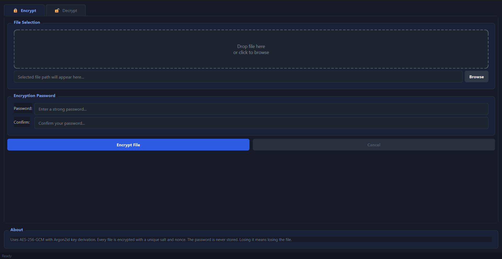
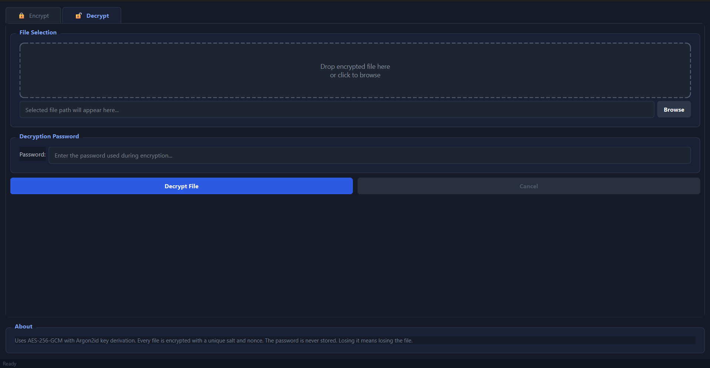

<div align="center">

# 🔐 Advanced Encryption Tool

**A production-grade, cross-platform desktop file encryption utility.**

[](https://github.com/uzx-02/advanced-encryption-tool/actions)
[](https://www.python.org/)
[](https://riverbankcomputing.com/software/pyqt/)
[](https://cryptography.io/)
[](https://www.rfc-editor.org/rfc/rfc9106)
[](https://github.com/uzx-02/advanced-encryption-tool)
[](LICENSE)

</div>

---

## Overview

The **Advanced Encryption Tool (AET)** is a security-first desktop application for encrypting and decrypting files of any size. It is built on a strict architecture that separates cryptographic logic from UI concerns, runs all crypto operations off the main thread, and enforces secure memory practices throughout.

**This is not a wrapper around `openssl` or a trivial XOR cipher.** AET implements a custom binary envelope format (`AETv1`) backed by AES-256-GCM and Argon2id that survives real-world adversarial conditions: wrong passwords, truncated files, bit-flip attacks, and chunk reordering are all detected and rejected cleanly.

---

## Features

| Feature | Detail |
|---|---|
| **Cipher** | AES-256-GCM — authenticated, stream-safe, NIST-approved |
| **KDF** | Argon2id (RFC 9106) — memory-hard, GPU/ASIC resistant |
| **Streaming** | 64 KB chunked I/O — encrypts multi-GB files without loading into RAM |
| **Tamper detection** | GCM authentication tag per chunk; any bit-flip = hard fail |
| **Truncation protection** | EOF state bound into each chunk's Associated Data |
| **Parameter agility** | Argon2 parameters stored per-file; future-proof without breaking old files |
| **Thread safety** | All crypto runs on `QThread`; GUI never blocks |
| **Cooperative cancellation** | `threading.Event` — safe mid-operation abort with clean file handle closure |
| **Memory safety** | Password `bytearray` zeroed in `finally` blocks — survives exceptions |
| **Drag & drop** | Native OS drag-and-drop file selection via custom `FileDropArea` widget |

---

## Screenshots

| Encrypt Tab | Decrypt Tab |
|:-----------:|:-----------:|
|  |  |

---

## Architecture

AET enforces a strict three-layer separation of concerns:

```
┌──────────────────────────────────────────────────────┐
│  Presentation Layer  ·  src/ui/main_window.py         │
│  Drag-drop UI, form validation, visual state          │
└────────────────────┬─────────────────────────────────┘
                     │ signals / slots
┌────────────────────▼─────────────────────────────────┐
│  Worker Layer  ·  src/ui/workers/encryption_thread.py │
│  QThread bridge, progress relay, memory zeroization   │
└────────────────────┬─────────────────────────────────┘
                     │ function calls
┌────────────────────▼─────────────────────────────────┐
│  Crypto Core  ·  src/core/encryption.py               │
│  Pure AES-GCM/Argon2id engine — UI-agnostic           │
└──────────────────────────────────────────────────────┘
```

The crypto core has **zero knowledge** of the UI. The main window has **zero knowledge** of cryptographic primitives. This makes each layer independently testable and replaceable.

### Encryption Workflow

```
Password (str)
    │
    ▼  bytearray encode
EncryptionThread.__init__
    │
    ▼  QThread.start()
EncryptionThread.run()
    │
    ├── Argon2id KDF  ──── salt (16 B, OS random) ──► 256-bit key
    │
    ├── AES-GCM encrypt  ── base_nonce (7 B) + chunk_counter (5 B) ──► 12-byte nonce/chunk
    │
    ├── Per-chunk AAD = pack(chunk_index, is_last_chunk)
    │      └── Prevents reordering and truncation attacks
    │
    └── Write AETv1 envelope header → sequential authenticated chunks
```

### AETv1 Binary Format

```
Offset   Size    Field
──────   ──────  ──────────────────────────────
0        5 B     Magic: "AETv1"
5        4 B     Argon2 Memory Cost (uint32, big-endian)
9        4 B     Argon2 Time Cost   (uint32, big-endian)
13       4 B     Argon2 Parallelism (uint32, big-endian)
17       16 B    Salt
33       7 B     Base Nonce
──────   ──────  ── Header Total: 40 bytes ──
40       4 B     Chunk 0 plaintext length (uint32)
44       N+16 B  Chunk 0 ciphertext + 16-byte GCM tag
...      ...     Chunk 1, 2, ... (repeated)
```

---

## Technology Stack

| Component | Technology |
|---|---|
| Language | Python 3.11+ |
| UI Framework | PyQt6 ≥ 6.11 |
| Cryptography | `cryptography` ≥ 48.0.0 (OpenSSL-backed) |
| KDF | Argon2id — RFC 9106 |
| Cipher | AES-256-GCM — NIST SP 800-38D |
| Testing | pytest, pytest-cov, pytest-qt |
| CI/CD | GitHub Actions (Ubuntu, xvfb headless) |
| Packaging | PyInstaller (single-file binary) |

---

## Installation

### Prerequisites

- Python 3.11 or later
- A virtual environment (recommended)

### Development Setup

```bash
# 1. Clone
git clone https://github.com/yourusername/Advanced-Encryption-Tool.git
cd Advanced-Encryption-Tool

# 2. Create and activate a virtual environment
python -m venv .venv

# Windows
.\.venv\Scripts\activate
# macOS / Linux
source .venv/bin/activate

# 3. Install dependencies
pip install -r requirements.txt

# 4. Launch
python -m src.main
```

### Pre-Built Binary (Windows)

Download `Advanced-Encryption-Tool.exe` from the [Releases](https://github.com/yourusername/Advanced-Encryption-Tool/releases) page. No Python installation required.

---

## Usage

1. **Select a file** — drag and drop a file onto the drop zone, or click **Browse**.
2. **Enter a password** — use a strong, unique passphrase.
   - For encryption, confirm the password in the second field.
3. **Choose a destination** — a native save dialog will prompt for the output path.
4. **Execute** — click **Encrypt File** or **Decrypt File**.

> **⚠️ Warning:** AET does not store or recover passwords. A lost password means the encrypted data is mathematically unrecoverable.

A progress bar appears automatically for files larger than **50 MB** to indicate streaming status.

---

## Security Design

### Memory Safety

Python's garbage collector does not guarantee when objects are freed. AET explicitly zeroes the password `bytearray` in a `finally` block immediately after key derivation — ensuring the raw password material cannot be extracted from a memory dump even if an exception occurs mid-operation.

```python
finally:
    if key_bytes:
        key_bytes[:] = b'\x00' * len(key_bytes)
```

### Cryptographic Primitive Selection

| Choice | Justification |
|---|---|
| AES-256-GCM | NIST-approved AEAD — one pass provides confidentiality + integrity |
| Argon2id | RFC 9106 winner; resists both GPU (Argon2i) and side-channel (Argon2d) attacks |
| 16-byte salt (per file) | Prevents rainbow tables and cross-file correlation |
| 12-byte nonce (per chunk) | GCM standard nonce size; unique per chunk via counter |
| GCM tag validation | Hard-fails on any ciphertext modification — no silent corruption |

### Thread Safety

All cryptographic work executes on a `QThread`. The main GUI thread only receives `pyqtSignal` updates — it never touches file handles or key material directly. Cancellation is cooperative: `threading.Event` allows the background thread to finish its current chunk cleanly before exiting, ensuring file handles are closed and the `finally` block always executes.

### Logging

In production, all errors are emitted via Python's `logging` module (`WARNING` and above) rather than `print()`. This allows operators to route and filter logs without modifying source code.

---

## Building a Standalone Executable

```bash
# Ensure you are in your activated virtual environment
pip install pyinstaller
python build.py
```

The compiled binary is written to `dist/Advanced-Encryption-Tool.exe`. The build script:
- Cleans prior `dist/` and `build/` directories
- Bundles all PyQt6 and `cryptography` submodules
- Produces a single-file `--onefile --windowed` executable

---

## Testing

### Running Locally

```bash
# Windows
.\run_tests.ps1

# Linux / macOS
chmod +x run_tests.sh && ./run_tests.sh
```

### Test Results (v1.0.0)

| Suite | Tests | Passed | Failed | Coverage |
|---|:---:|:---:|:---:|:---:|
| `test_encryption_core.py` | 31 | ✅ 31 | 0 | 98% |
| `test_encryption_thread.py` | 11 | ✅ 11 | 0 | — |
| **Total** | **42** | **✅ 42** | **0** | **98%** |

> Floor: 95% · Actual: **98%** · Runtime: **< 1 second**

### Coverage Breakdown

```
Name                          Stmts   Miss   Cover
──────────────────────────────────────────────────
src/core/__init__.py              0      0   100%
src/core/encryption.py          120      2    98%
──────────────────────────────────────────────────
TOTAL                           120      2    98%
```

The 2 uncovered lines are the `if is_last_chunk: break` exits inside the EOF lookahead — they are structurally reachable only when a file ends precisely on a chunk boundary (e.g., an exact multiple of 65,536 bytes), which is an extremely narrow edge case that is implicitly exercised by the large-file roundtrip tests.

### Test Categories

- **Key derivation**: determinism, length, salt uniqueness, type enforcement
- **Nonce construction**: uniqueness, determinism, counter overflow safety
- **Roundtrip correctness**: small files, multi-chunk large files, text files
- **Tamper detection**: bit-flip → GCM tag mismatch, magic byte overwrite
- **Error conditions**: wrong password, truncated file, nonexistent file, empty file
- **Parameter agility**: files encrypted under non-default Argon2 profiles decrypt correctly
- **Thread signals**: `operation_finished` and `progress_updated` emission correctness
- **Memory zeroization**: password `bytearray` confirmed zeroed after success and failure paths

---

## Project Structure

```
Advanced-Encryption-Tool/
│
├── .github/
│   └── workflows/
│       └── verify-and-test.yml   # CI: headless Ubuntu matrix (Python 3.11, 3.12)
│
├── docs/
│   └── screenshots/
│       ├── encrypt.png           # Encrypt tab screenshot
│       └── decrypt.png           # Decrypt tab screenshot
│
├── src/
│   ├── core/
│   │   ├── __init__.py
│   │   └── encryption.py         # AES-256-GCM / Argon2id engine (UI-agnostic)
│   ├── ui/
│   │   ├── components/
│   │   │   └── drop_area.py      # Drag-and-drop file selection widget
│   │   ├── workers/
│   │   │   └── encryption_thread.py  # QThread worker + cooperative cancellation
│   │   └── main_window.py        # Root window: layout, validation, state
│   └── main.py                   # Entrypoint: Qt init, font, HiDPI, event loop
│
├── tests/
│   ├── conftest.py               # Shared fixtures, fast Argon2 patch
│   ├── test_encryption_core.py   # 31 tests for the crypto engine
│   └── test_encryption_thread.py # 11 tests for the QThread worker
│
├── .gitignore
├── build.py                      # PyInstaller automation script
├── LICENSE                       # MIT License
├── README.md
├── requirements.txt
├── run_tests.ps1                 # Windows test runner
└── run_tests.sh                  # Linux / macOS test runner
```

---

## Configuration

There are no configuration files to edit. Cryptographic parameters are defined as class-level constants in `src/core/encryption.py` and can be overridden for testing:

```python
EncryptionCore.ARGON2_MEMORY_COST = 65536   # KiB (default: 64 MB)
EncryptionCore.ARGON2_TIME_COST   = 3       # iterations
EncryptionCore.ARGON2_PARALLELISM = 4       # parallel lanes
EncryptionCore.CHUNK_SIZE         = 65536   # bytes per streaming block
```

---

## Known Limitations

- **No password recovery** — by design. Argon2id derives a key deterministically from password + salt. There is no backdoor.
- **No folder encryption** — individual files only. For directories, compress to `.zip` first.
- **Windows-centric font** — `Segoe UI` is specified at startup; macOS and Linux fall back to system defaults gracefully.
- **Single-file output** — each file produces one `.aet` output; there is no archive or container format.

---

## Roadmap

- [ ] **Folder encryption** — native `.zip` or `.tar` encapsulation before encryption
- [ ] **macOS / Linux theme polish** — platform-aware stylesheet for native look-and-feel
- [ ] **Hardware key support** — YubiKey / FIDO2 integration for hardware-bound KDF
- [ ] **CLI interface** — headless `aet encrypt <file>` for scripting and server use
- [ ] **Secure file deletion** — overwrite source file on disk after successful encryption

---

## Contributing

Contributions, bug reports, and feature requests are welcome.

1. Fork the repository.
2. Create a feature branch: `git checkout -b feature/your-feature`
3. Commit with clear messages: `git commit -m 'feat: add folder encryption support'`
4. Ensure all tests pass: `python -m pytest tests/`
5. Ensure coverage does not drop below 95%: `--cov-fail-under=95`
6. Open a Pull Request against `main`.

Please do **not** introduce alternative cryptographic primitives (e.g., AES-CBC, SHA-1, MD5) without opening an issue first and providing a security rationale.

---

## License

Distributed under the **MIT License**. Copyright © 2026 Uzair Shaikh.  
See [`LICENSE`](LICENSE) for the full text.

---

## Acknowledgements

- [Python Cryptography Authority (PyCA)](https://github.com/pyca/cryptography) — for the `cryptography` library powering AES-GCM and Argon2id.
- [Riverbank Computing](https://riverbankcomputing.com/) — for PyQt6.
- [OWASP Password Storage Cheat Sheet](https://cheatsheetseries.owasp.org/cheatsheets/Password_Storage_Cheat_Sheet.html) — for Argon2id parameter baselines.
- [RFC 9106](https://www.rfc-editor.org/rfc/rfc9106) — Argon2 Memory-Hard Function for Password Hashing and Proof-of-Work Applications.
